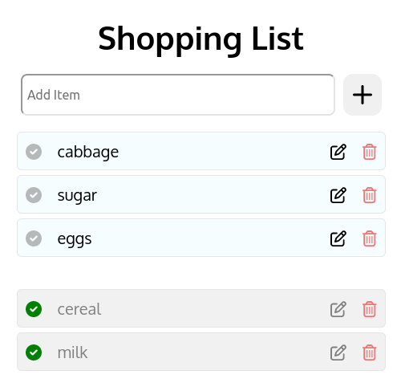

# Shopping List App

  

A web-based Shopping List written in plain-vanilla JavaScript. Currently this is
in a seriously **alpha stage**, with incomplete styling.

This application is to teach myself "plain" JavaScript as opposed to using a
library like `React` or similar. Also, I always forget to take my shopping list
with me, but never forget my phone!!

For development purposes, you can pre-seed the list with 5 items by adding an
item 'test' to the list.

**Note : This app uses the PRO (Paid) version of FontAwesome icons at the moment.
I'll look at replacing this with a free solution when the app is completed.**

## Functionality that is Working

- Add a new List Item.
- Delete an existing List Item or complete list.
- Toggle an item as done. If toggled, it is moved to a different list below. If
  toggled again, it is moved back to the main list.
- Edit an item name inline.
- Save current items to LocalStorage so they persist between sessions.
- Drag and drop ordering of items, even between lists. Does not work on Mobile
  devices
- Light/Dark mode toggle
- Responsive Design

## Functionality Planned

- Disallow duplicate items.
- Allow quantity. If blank just add 1. Optionally select 'type' of quantity (ie
  pack, box, pallet etc).
- Add comment to an item.
- add item to category - ie Fresh, Frozen, Bakery etc.
- implement User login system, each with their own list(s) - use Firebase Auth
  for this? (that would enable login with google/facebook etc.)
- Store items using Firebase or similar noSQL system.
- Group items by Shop.
- Remember previous items and shops for later input.
- Save the entire list as a favourite, ability to load from saved favourites
  overwriting any current list.
- add a toaster-notification system for add/complete/delete/errors etc. Try
  write from scratch.

## Other TODO

- `Escape` key to cancel editing List, perhaps also `blur` event which is better
  for mobile.
- possibly replace LocalStorage with IndexedDB to allow async. Probably won't
  speed up this app much but would be a decent learning experience.
- implement accordian drop-downs for each list.

## Development

Development needs [Node.JS](https://nodejs.org/) to be installed and optionally
[yarn](https://yarnpkg.com/). **These are NOT needed for production once the
optimized bundle is created.**

1) Fork or Checkout this repository then change into that directory.
2) Install dependencies using `npm install` or `yarn install`
3) Run the development server using `npm run dev` or `yarn dev` then access
   <http://localhost:8080> to use the app.

## Deployment

To create a production minimised version, run `npm prod` (or `yarn prod`
depending on your preference) from the project root:

This will create an optimised version in the [dist](dist) folder, the contents
of which can then be served from any standard web server or service.
